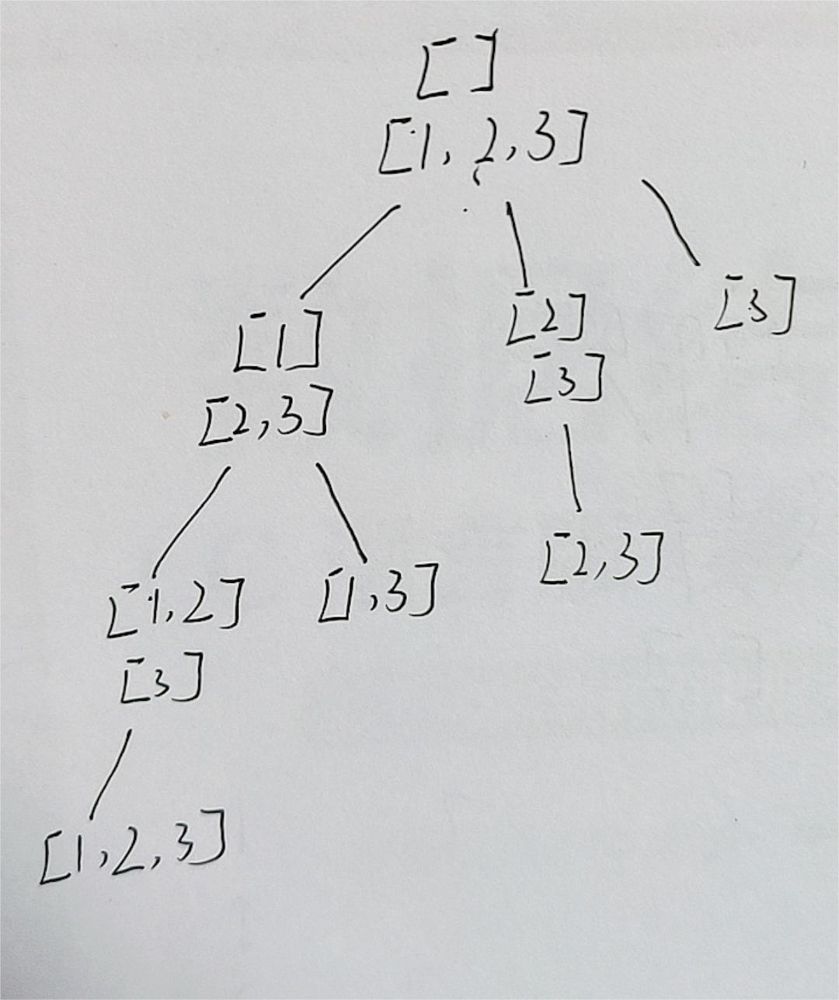

### [78. 子集](https://leetcode.cn/problems/subsets/)

画出决策树，可以发现每个节点都有答案。



可以看到，跟全排列的决策树不是很像

1. 不能有重复的
2. 每个节点都要取

现在想到的就这两点，那么要怎么解决呢，不能有重复的，那就设一个index，准备取的数字都是从index往后开始取。每个节点都要取，因为每个节点就是递归一次，那就在每次递归的时候把答案加进去（全排列答案在叶子节点上，所以说在每次终止条件return的时候加答案）

```java
class Solution {
    public List<List<Integer>> subsets(int[] nums) {
        List<List<Integer>> lists = new ArrayList<List<Integer>>();
        List<Integer> list = new ArrayList<Integer>();

        resubsets(0, nums, list, lists);

        return lists;
    }

    public void resubsets(int index, int[] nums, List<Integer> list, List<List<Integer>> lists) {
        lists.add(new ArrayList<Integer>(list));
        for (int i = index; i < nums.length; i++) {
            list.add(nums[i]);
            resubsets(i + 1, nums, list, lists);
            list.remove(list.size() - 1);
        }
        return;

    }
}
```

