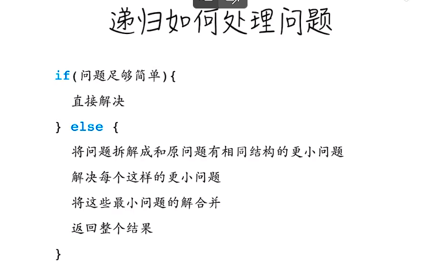
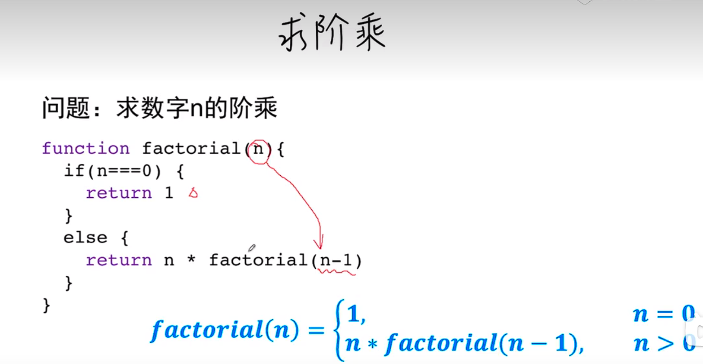
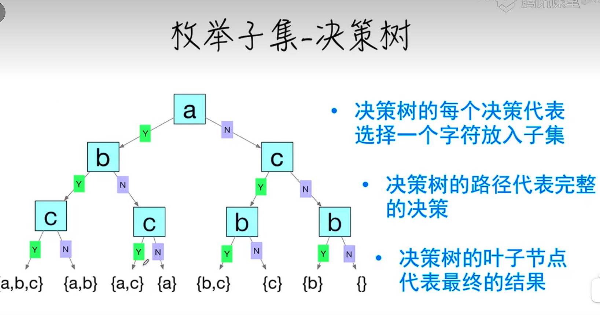
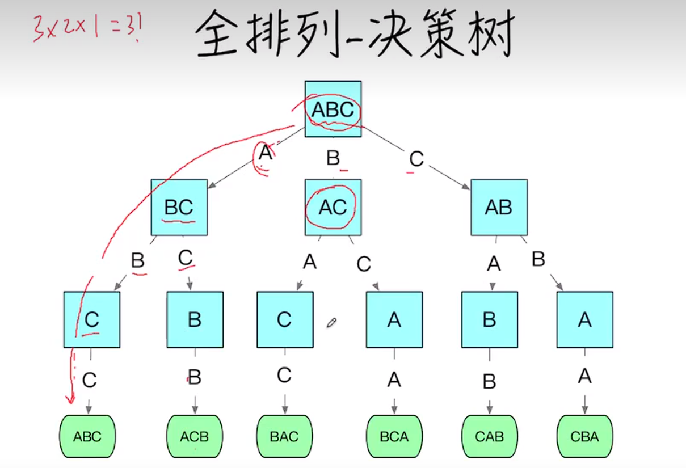
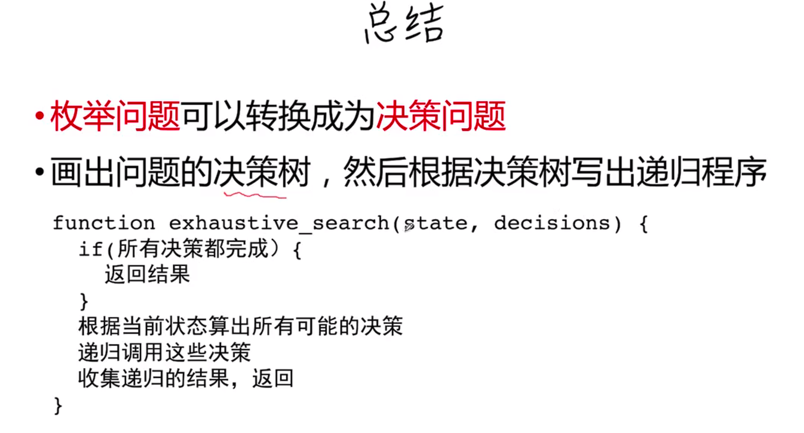
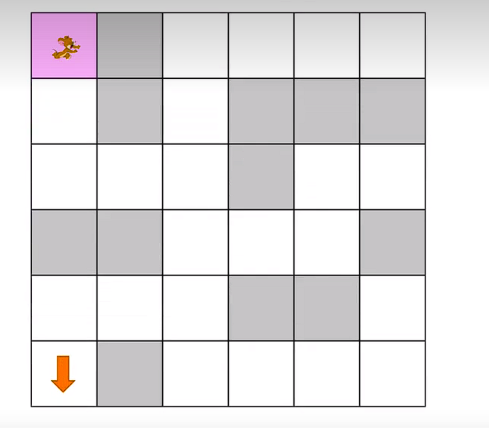
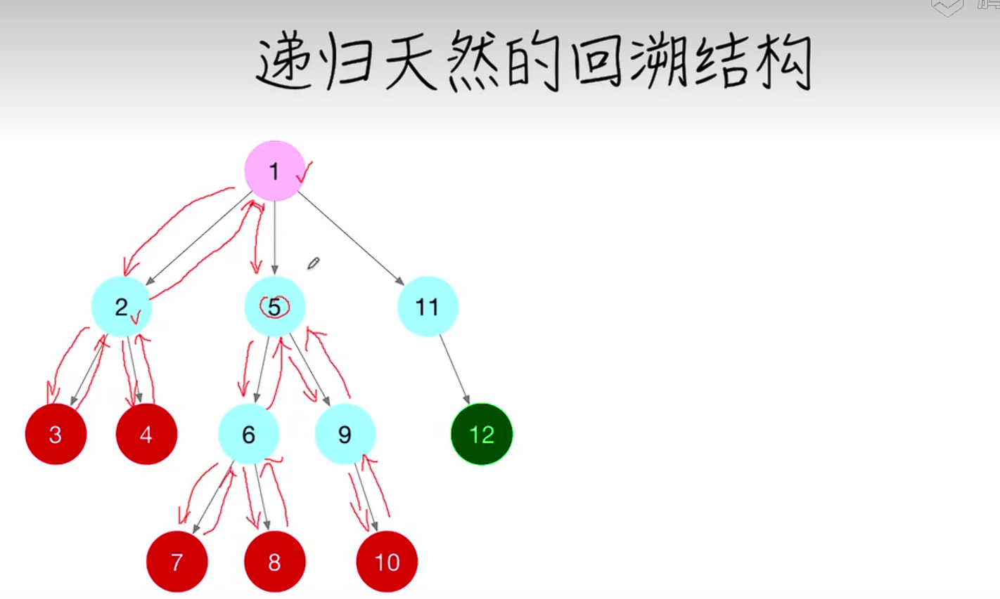

### 递归，回溯思想

​	递归本质就是分而治之，将一个大问题分为n个小问题

例题，求n的阶乘，可以先看看分段函数

#### 递归穷举（组合）

例题，求出{a，b，c}的所有子集

**引出新知识点，决策树 决策树很适合用递归，所以转成决策树，像以下决策树，递归终止条件就是决策的次数会等于字符串的长度，所以每次需要新开一个bool数组去存储每次决策的策略，然后统计该bool数组的长度是否等于字符串的长度（可以优化）。递归的策略就是每次决策要么就是true要么就是false**

再进阶一点的决策树就是全排列的问题

总结：

#### 递归回溯

老鼠找出口

递归天然的回溯结构，并不用去特意的写代码

